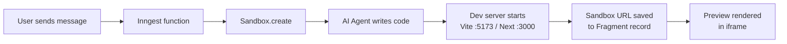
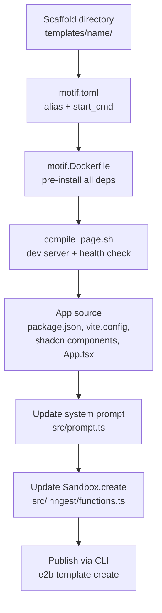
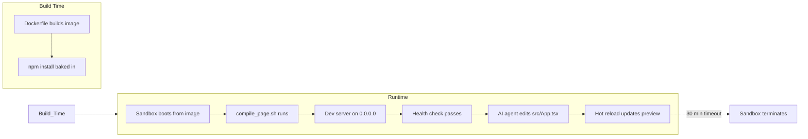

# Motif(Template) Creation System

mSpace uses Motif sandboxes to execute AI-generated code in isolated environments to create mutable applications called Motifs. When a user chats with the AI agent, the agent writes code into a sandbox, which becomes a live preview rendered in the browser. Motifs define what's pre-installed in those sandboxes so they boot in milliseconds with all dependencies ready.

## Architecture Overview

### Runtime Flow — User Message to Live Preview




### Motif Creation Flow — Building a New Template




### Sandbox Lifecycle




```
User sends message
  → Inngest function triggers (src/inngest/functions.ts)
  → Sandbox.create("<Motif-alias>") spins up an Motif sandbox
  → AI agent writes code into sandbox via tools (createOrUpdateFiles, terminal, readFiles)
  → Sandbox runs Vite/Next.js dev server on a known port
  → Sandbox URL is saved to the Fragment record in the database
  → Frontend renders the preview via iframe or Sandpack (src/modules/spaces/ui/components/fragment-web.tsx)
```

### How the Sandbox is Created

```typescript
// src/inngest/functions.ts
const sandbox = await Sandbox.create("mspace-react-shadcn", {
  apiKey: process.env.space_API_KEY,
  envs: sandboxEnv,        // mHive data source credentials + context
  allowInternetAccess: true,
});
await sandbox.setTimeout(SANDBOX_TIMEOUT_IN_MS); // 30 min
```

The Motif alias (`"mspace-react-shadcn"`) maps to the `Motif_name` in `Motif.toml`. Environment variables like `MHIVE_DATA_SOURCE_ID`, `DATASET_JSON`, and `MHIVE_API_TOKEN` are injected at sandbox creation time.

### How the Preview URL is Resolved

```typescript
const host = sandbox.getHost(5173); // port must match the dev server
return `https://${host}`;
```

The port **must match** what `compile_page.sh` starts the dev server on. Currently:

- Vite Motifs → port `5173`
- Next.js Motifs → port `3000`

## Current Motifs


| Motif            | Alias                 | Stack                                              | Port | Startup |
| ---------------- | --------------------- | -------------------------------------------------- | ---- | ------- |
| **react-shadcn** | `mspace-react-shadcn` | Vite + React 18 + TS + Tailwind + shadcn           | 5173 | ~240ms  |
| **react-earth**  | `mspace-react-earth`  | Vite + React 18 + TS + CesiumJS + Resium + shadcn  | 5173 | ~240ms  |
| **nextjs**       | `mspace-nextjs-Motif` | Next.js 15 + shadcn (all components)               | 3000 | Slower  |


The **react-shadcn** Motif is used in production. It's fast because all dependencies are pre-installed and the Vite dev server starts near-instantly.

## Motif Directory Structure

Every Motif lives in `Motifs/<name>/` and needs three core files plus the application source:

```
Motifs/<name>/
├── Motif.toml              # Motif configuration
├── Motif.Dockerfile        # Docker image that becomes the sandbox
├── compile_page.sh       # Startup script (dev server + health check)
├── package.json          # Dependencies (Vite-based Motifs)
├── index.html            # Entry HTML (Vite-based Motifs)∫
├── vite.config.ts        # Vite config
├── tailwind.config.js    # Tailwind config
├── postcss.config.js     # PostCSS config
├── tsconfig.json         # TypeScript config
├── components.json       # shadcn/ui config
└── src/
    ├── main.tsx          # React entry point
    ├── App.tsx           # Main component (AI agent edits this)
    ├── channel.config.ts # Data contract (collections, fields, refresh)
    ├── index.css         # Tailwind + CSS variables (theme)
    ├── lib/
    │   ├── utils.ts      # cn() utility
    │   └── channel-types.ts  # TypeScript types for the channel system
    └── components/ui/    # Pre-installed shadcn components
        ├── button.tsx
        ├── card.tsx
        ├── table.tsx
        └── chart.tsx     # Custom chart wrapper around recharts
```

## Channel Config (`channel.config.ts`)

Each Motif includes a `src/channel.config.ts` file that declares the **data contract** between the sandbox and the mHive data layer. It tells the AI agent (and the runtime) what collections exist, what fields each collection has, and how data should be fetched.

```
src/
├── channel.config.ts          # Data contract (collections, fields, refresh)
└── lib/
    └── channel-types.ts       # TypeScript types for the channel system
```

### Structure

```typescript
const config: ChannelConfig = {
  collections: {
    primary: {                          // collection key
      description: "Main data table",
      fields: {
        id:     { type: "string", required: true },
        name:   { type: "string", required: true },
        value:  { type: "number" },
        status: { type: "string", enum: ["active", "pending", "inactive"] },
      },
      pagination: { defaultLimit: 25, maxLimit: 100 },
    },
    metrics: {
      description: "Aggregated chart data",
      fields: {
        label: { type: "string", required: true },
        value: { type: "number", required: true },
      },
    },
  },
  refreshInterval: 30000, // poll every 30 s (0 = manual only)
};
```

### Key Concepts

| Concept | Description |
| --- | --- |
| **Collection** | A named data set (e.g. `primary`, `metrics`). Maps to a table or query result from mHive. |
| **Field** | A typed column inside a collection. Supported types: `string`, `number`, `boolean`, `array`, `object`. |
| **required** | Marks a field as non-nullable. |
| **enum** | Restricts a string field to a fixed set of values. |
| **pagination** | Optional per-collection limits (`defaultLimit`, `maxLimit`). |
| **refreshInterval** | Milliseconds between automatic data re-fetches. `0` disables auto-refresh. |

### How It's Used

1. **Baseline contract** — The config ships with sensible defaults so the Motif compiles out of the box.
2. **AI override** — At build time the AI agent may extend or fully replace the config based on the user's request and the actual mHive data schema injected via environment variables.
3. **Runtime validation** — Components can import the config to know which fields to render in tables, charts, and forms without hard-coding column names.

### Type System

All types live in `src/lib/channel-types.ts`:

- `ChannelConfig` — top-level config shape (collections + refreshInterval).
- `ChannelCollectionDef` — a single collection (fields + optional pagination).
- `ChannelFieldDef` — a single field (type, required, enum, description).
- `ChannelDataPayload` / `ChannelStatusPayload` / `ChannelSchemaPayload` — runtime message shapes exchanged between the sandbox and the host.

## Creating a New Motif

### Step 1: Scaffold the Directory

```bash
mkdir -p Motifs/<Motif-name>/src/components/ui
```

### Step 2: Create `Motif.toml`

```toml
team_id = "4f145bbd-574d-49c8-b091-3241ea2a6bd4"
start_cmd = "/compile_page.sh"
dockerfile = "Motif.Dockerfile"
M
```

- `team_id` — MSTRO's Motif team (always the same value)
- `start_cmd` — the script Motif runs when a sandbox boots
- `Motif_name` — the alias your application code uses in `Sandbox.create()`
- `Motif_id` — omit on first creation; Motif assigns it after publishing

### Step 3: Create `Motif.Dockerfile`

This builds the sandbox image. The goal is to have **everything pre-installed** so sandbox startup is instant.

**Vite-based (recommended for speed):**

```dockerfile
FROM node:21-slim

RUN apt-get update && apt-get install -y curl && apt-get clean && rm -rf /var/lib/apt/lists/*

COPY compile_page.sh /compile_page.sh
RUN chmod +x /compile_page.sh

WORKDIR /home/user

# Copy all source files
COPY package.json tsconfig.json tsconfig.node.json ./
COPY vite.config.ts tailwind.config.js postcss.config.js ./
COPY components.json index.html ./
COPY src/ src/

# Pre-install dependencies at build time
RUN npm install
```

**Next.js (scaffolds at build time):**

```dockerfile
FROM node:21-slim

RUN apt-get update && apt-get install -y curl && apt-get clean && rm -rf /var/lib/apt/lists/*

COPY compile_page.sh /compile_page.sh
RUN chmod +x /compile_page.sh

WORKDIR /home/user/nextjs-app
RUN npx --yes create-next-app@15.3.4 . --yes
RUN npx --yes shadcn@2.6.3 init --yes -b neutral --force
RUN npx --yes shadcn@2.6.3 add --all --yes

RUN cp -a /home/user/nextjs-app/. /home/user/ && rm -rf /home/user/nextjs-app
```

Key requirements:

- Base image: `node:21-slim`
- Install `curl` (used by `compile_page.sh` for health checks)
- `WORKDIR` must be `/home/user` (this is where the AI agent writes files)
- All `npm install` must happen at build time, not at runtime

### Step 4: Create `compile_page.sh`

This script starts the dev server and polls until it responds with HTTP 200. Motif uses it as the `start_cmd`.

```bash
#!/bin/bash

function ping_server() {
    counter=0
    response=$(curl -s -o /dev/null -w "%{http_code}" "http://localhost:<PORT>")
    while [[ ${response} -ne 200 ]]; do
        let counter++
        if (( counter % 10 == 0 )); then
            echo "Waiting for server to start..."
        fi
        sleep 0.5
        response=$(curl -s -o /dev/null -w "%{http_code}" "http://localhost:<PORT>")
    done
}

ping_server &
cd /home/user && <DEV_SERVER_COMMAND>
```

Replace `<PORT>` and `<DEV_SERVER_COMMAND>`:


| Stack   | Port | Command                         |
| ------- | ---- | ------------------------------- |
| Vite    | 5173 | `npm run dev -- --host 0.0.0.0` |
| Next.js | 3000 | `npx next dev --turbopack`      |


The server **must** bind to `0.0.0.0` — Motif proxies from the outside, so `localhost`-only binding won't work.

### Step 5: Set Up the Application Source

For a Vite-based Motif, you need these files at minimum:

`**package.json`** — Pin all dependency versions. Include:

- `react`, `react-dom` — UI framework
- `@radix-ui/*` — Primitives for shadcn components
- `class-variance-authority`, `clsx`, `tailwind-merge` — shadcn utility dependencies
- `lucide-react` — Icons
- `recharts` — Charts (if needed)
- `vite`, `@vitejs/plugin-react`, `typescript` — Dev tooling
- `tailwindcss`, `autoprefixer`, `postcss` — Styling

`**vite.config.ts`** — Must bind to `0.0.0.0`:

```typescript
import { defineConfig } from 'vite'
import react from '@vitejs/plugin-react'
import path from 'path'

export default defineConfig({
  plugins: [react()],
  resolve: {
    alias: {
      "@": path.resolve(__dirname, "./src"),
    },
  },
  server: {
    host: '0.0.0.0',
    port: 5173,
    allowedHosts: true,
  },
})
```

`**components.json**` — shadcn config with `rsc: false` (no server components in Vite):

```json
{
  "$schema": "https://ui.shadcn.com/schema.json",
  "style": "new-york",
  "rsc": false,
  "tsx": true,
  "tailwind": {
    "config": "tailwind.config.js",
    "css": "src/index.css",
    "baseColor": "neutral",
    "cssVariables": true
  },
  "aliases": {
    "components": "@/components",
    "utils": "@/lib/utils",
    "ui": "@/components/ui"
  }
}
```

`**src/index.css**` — Must define all CSS variables for shadcn theming (light + dark mode). Copy from the existing `react-shadcn` Motif.

`**src/components/ui/**` — Pre-install the shadcn components the AI agent will use. The AI is instructed via the system prompt (`src/prompt.ts`) which components are available, so the Motif and the prompt must stay in sync.

`**src/App.tsx**` — The default starting point. The AI agent will overwrite this file with generated code. Include sample imports so the Motif compiles out of the box.

### Step 6: Update the System Prompt

The AI agent needs to know what's available in the sandbox. Edit `src/prompt.ts` to reflect:

- Which framework/libraries are installed
- Which shadcn components are available as imports
- What the main editable file is (e.g., `src/App.tsx`)
- What port the dev server runs on
- Which commands should NOT be run (e.g., `npm run dev`)

Example from the current prompt:

```
Environment:
- Vite + React 18 + TypeScript
- Tailwind CSS + Shadcn UI pre-configured
- Main file: src/App.tsx (ONLY edit this file)
- Dev server running on port 5173 with hot reload

MANDATORY IMPORTS - Always include these at the top of src/App.tsx:
import { Card, ... } from "@/components/ui/card"
import { Table, ... } from "@/components/ui/table"
import { Button } from "@/components/ui/button"
```

### Step 7: Update Application Code

In `src/inngest/functions.ts`, update the `Sandbox.create()` call to use the new Motif alias:

```typescript
const sandbox = await Sandbox.create("mspace-<Motif-name>", {
  apiKey: process.env.space_API_KEY,
  envs: sandboxEnv,
  allowInternetAccess: true,
});
```

Update `resolveSandboxUrl()` if the port differs from 5173:

```typescript
const host = sandbox.getHost(<PORT>);
```

## Publishing to Motif

### Prerequisites

- Motif API key in `.env` as `space_API_KEY`
- Motif CLI: `pnpm dlx @Motif/cli@latest`

### Publish

```bash
cd Motifs/<Motif-name>

# Load credentials
set -a && source ../../.env
export space_ACCESS_TOKEN="$space_API_KEY"

# Build and publish
pnpm dlx @Motif/cli@latest Motif create mspace-<Motif-name> \
  --dockerfile Motif.Dockerfile \
  --cmd /compile_page.sh \
  --ready-cmd "sleep 1"
```

After publishing, the CLI outputs a `Motif_id`. Save it back into `Motif.toml`.

### Verify

```bash
pnpm dlx @Motif/cli@latest Motif list
```

### Update an Existing Motif

Same publish command. The CLI detects the existing `Motif_id` in `Motif.toml` and updates in place. No application code changes needed if the alias stays the same.

## Design Constraints

1. **Pre-install everything** — Sandboxes cannot run `npm install` at runtime. All dependencies must be baked into the Docker image.
2. **Multi-screen support** — The AI agent can create and edit multiple screens/pages beyond `src/App.tsx`.
3. **Host binding** — Dev servers must listen on `0.0.0.0`, not `localhost`.
4. **Port consistency** — The port in `compile_page.sh`, `vite.config.ts`, and `resolveSandboxUrl()` must all match.
5. **Prompt ↔ Motif sync** — Any component added/removed from the Motif must be reflected in `src/prompt.ts`.
6. **30-minute timeout** — Sandboxes auto-terminate after `SANDBOX_TIMEOUT_IN_MS` (configurable in `src/constants.ts`).
7. **Environment variables** — Data context (`DATASET_JSON`, `MHIVE_`*) is injected at sandbox creation, not baked into the Motif.

## Adding New shadcn Components to an Existing Motif

1. Add the component file to `Motifs/<name>/src/components/ui/`
2. Add its Base dependency to `package.json` if needed
3. Update `src/prompt.ts` with the new import path
4. Republish the Motif (see Publishing section)
5. Existing sandboxes are unaffected — only new sandboxes use the updated Motif

